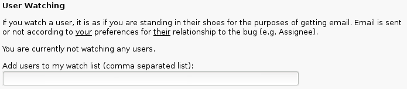

# Filtering Email Notifications
Bugzilla sends emails with many headers. The following headers can be very useful for sorting email:
* X-Bugzilla-Watch-Reason: contains fields (like 'AssignedTo', 'CC') of the bug and the email address being watched (bugs@gluster.org)
* X-Bugzilla-Product: should always be 'GlusterFS' for Gluster bugs
* X-Bugzilla-Component: the component of the bug (like 'glusterd')
* X-Bugzilla-Status: you may want to filter 'NEW' bugs in a special folder
* X-Bugzilla-Keywords: new contributors may want to filter bugs marked with [EasyFix](http://docs.gluster.org/en/latest/Developer-guide/Easy-Fix-Bugs)

It is recommended to filter the emails from the list in a dedicated folder. Some users only move/label messages on certain headers and delete everything else that comes through the mailing list.

For example, to receive mails of the component *glusterd*,

using Zimbra mail client,
* go to *Preferences*
* select *New Filter*
* Add *Filter Name*
* Include and apply a rule as
   * **Header Named** _X-Bugzilla-Component_ **contains** _glusterd_

using Mozilla Thunderbird mail client,
* go to *Tools*
* select *Message Filters*
* select *New..*
* Add *Filter Name*
* In the rules section, select *Customize*
* Add New message header name as *X-Bugzilla-Component*
* Now include and apply a rule as
   * _X-Bugzilla-Component_ **contains** _glusterd_

# Mailinglist
The [bugs@gluster.org](http://gluster.org/mailman/listinfo/bugs) mailing list gets added by default to new bugs. Anyone can subscribe to the list in order to receive all updates on all Gluster bugs.

# 'Watch' a user in Bugzilla
It is possible to use the Bugzilla "watches" function to receive updates on bug reports where the bugs@gluster.org pseudo-user is on CC.

Configuration instructions:

1. go to https://bugzilla.redhat.com and log in

2. go to your [preferences](https://bugzilla.redhat.com/userprefs.cgi)

3. go to the [email tab](https://bugzilla.redhat.com/userprefs.cgi?tab=email)

4. on the bottom of the page, under "user watching", add "bugs@gluster.org"

    

5. the result

   

# RSS Feeds
The URLs below can be added to an RSS reader (like Mozilla Thunderbird or [feedly](https://feedly.com)). When you prefer a list of bugs on the Bugzilla website, open the RSS-feed in your browser and remove the *ctype=atom* from the end of the URL.

For [Bug Triagers](http://docs.gluster.org/en/latest/Contributors-Guide/Bug-Triage/):
* [NEW Gluster Bugs to Triage](http://goo.gl/llNxe9) (any version)
* [NEW Gluster 3.4 Bugs](http://goo.gl/QwF1cM)
* [NEW Gluster 3.5 Bugs](http://goo.gl/agtGd2)
* [NEW Gluster 3.6 Bugs](http://goo.gl/mta1s8)
* [NEW GlusterD Bugs](http://goo.gl/8H3NMV)
* [NEW Gluster/NFS Bugs](http://goo.gl/ZHKn3W)
* [NEW geo-replucation Bugs](http://goo.gl/1mKTCf)

For starting developers who want to send their [[EasyFix Bugs|first patches]]:
* [EasyFix Gluster Bugs](http://goo.gl/OpQwlv)

For component maintainers and developers looking for a bug to start working on:
* [Triaged Gluster 3.4 Bugs](http://goo.gl/R9347I)
* [Triaged Gluster 3.5 Bugs](http://goo.gl/hNHVnU)
* [Triaged Gluster 3.6 Bugs](http://goo.gl/O8qdZo)
* [Triaged NEW Gluster/NFS Bugs](http://goo.gl/MrHwb0)

Bugs that can get tested
* ...

Feel free to add more feeds to this page yourself, request them via [gluster-devel](gluster-devel@gluster.org) or [Github issue tracker](https://github.com/gluster/glusterdocs/issues).

